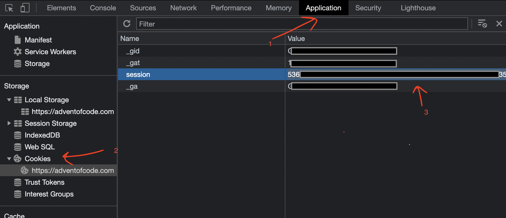

# Advent of Code

## Puzzles by years

- [2022](./src/main/kotlin/com/yonatankarp/adventofcode/aoc2022/README.md)

## How to work on a new puzzle?

Whenever you work on a new puzzle, simply run [Main.kt](./src/main/kotlin/com/yonatankarp/adventofcode/Main.kt).
It will automatically generate for you a new class for the day, and a new class
for testing. Make sure to set the year and day correctly before running.

To download the input of the file, you need to pass the parameter `download`
to the script, and set your [session_cookie.txt](./src/main/resources/session_cookie.txt).

The cookie can be found by following those steps:

- Open [adventofcode.com](https://adventofcode.com/) in your browser
- Open the developers tool in your browser
- Navigate to `Application` -> `Storage` -> `Cookies` and copy your session

